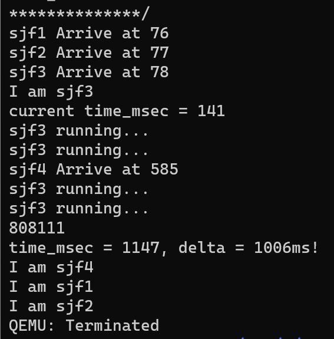
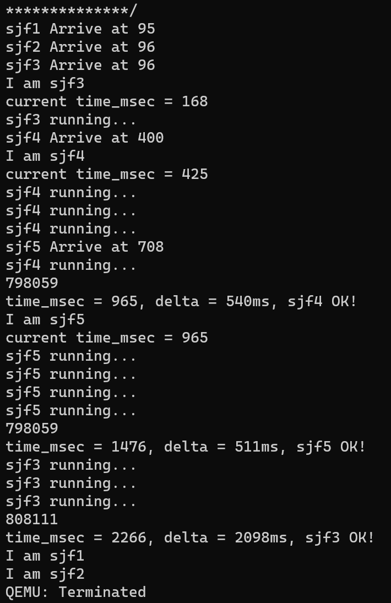
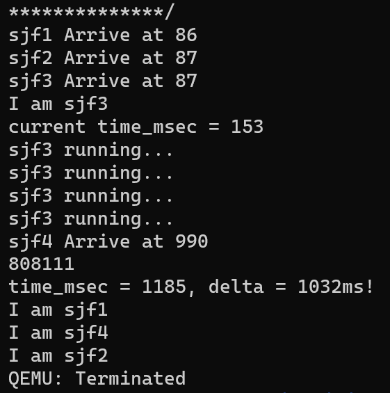

# 批处理系统与交互式系统的调度

### 先来先服务(FCFS)

先来先服务（first-come first-severd，也称First-in first-out，先进先出）调度策略的基本思路就是按进程请求处理器的先后顺序来使用处理器。在具体实现上，操作系统建立一个就绪队列，当一个应用进入被加载，并创建为进程进入就绪态后，就按先后顺序放入就绪队列尾；操作系统从就绪队列头取出进程来执行。操作系统不会主动打断进程的运行。当正在运行的进程主动放弃处理器，操作系统会把该进程放到就绪队列末尾，并从就绪队列头取出新进程执行；当正在运行的进程阻塞时，操作系统会把该进程放到阻塞队列中，并从就绪队列头取出新进程执行；当阻塞进程转为就绪进程后，操作系统 会把该进程放到就绪队列末尾。

该调度策略的优点是简单，容易实现。对于满足1~6的约束条件的执行环境，用这个调度策略的平均周转时间性能指标也很好。如果在一个在较长的时间段内，每个进程都能结束，那么公平性这个性能指标也是能得到保证的。

FCFS 策略的缺点是，短进程可被排在长进程后面，平均等待时间往往很长。

### 时间片轮转调度(RR)

时间片轮转（RR）调度算法是专门为分时系统设计的。它类似于 [FCFS调度](http://c.biancheng.net/view/1242.html)，但是增加了抢占以切换进程。

该算法中，将一个较小时间单元定义为时间量或时间片。时间片的大小通常为 10~100ms。就绪队列作为循环队列。CPU 调度程序循环整个就绪队列，为每个进程分配不超过一个时间片的 CPU。

为了实现 RR 调度，我们再次将就绪队列视为进程的 FIFO 队列。新进程添加到就绪队列的尾部。CPU 调度程序从就绪队列中选择第一个进程，将定时器设置在一个时间片后中断，最后分派这个进程。

现有的rCore-Tutorial便是按照这个逻辑在FCFS的基础上添加timer定时器，实现了RR调度。

### 最短作业优先(SJF)

最短作业优先（SJF）调度算法将每个进程与其下次 CPU 执行的长度关联起来。当 CPU 变为空闲时，它会被赋给具有最短 CPU 执行的进程。

理论上很简单，而SJF 算法的真正困难是如何知道下次 CPU 执行的长度。对于批处理系统的长期（或作业）调度，可以将用户提交作业时指定的进程时限作为长度。在这种情况下，用户有意精确估计进程时间，因为低值可能意味着更快的响应（过小的值会引起时限超出错误，进而需要重新提交）。SJF 调度经常用于长期调度。另一种方法是试图近似 SJF 调度。虽然不知道下一个 CPU 执行的长度，但是可以预测它。可以认为下一个 CPU 执行的长度与以前的相似。因此，通过计算下一个 CPU 执行长度的近似值，可以选择具有预测最短 CPU 执行的进程来运行。

#### 实现

要为rCore-Tutorial实现，我们需要获得所运行的进程的预期时间。由于rCore-Tutorial的进程创建机制是fork+exec，考虑在exec执行可执行文件时同步传入该进程的预期时间，即为exec系统调用添加一个参数，用来修改TCB中task_prediction项。这样，在Task_Manager向就绪队列添加任务时，按照prediction的大小插入指定的位置，保证每次取出的是最短的进程。

另一点需要注意的是，尽管SJF是抢占式STCF的基础，但由于fork+exec机制，在一个新进程被创建时，要首先调度到这个新进程，执行exec添加了prediction的值后，再停止该进程，重新运行run_next来选择最短进程，而不是回到被创建前的那个进程执行，实际上这更像抢占式。因此为了保证新进程到来后不抢占原进程，添加标志task_isrunning，对于正常运行中的进程此值为T，而仅执行exec的进程不置为T仍为F，在添加任务时优先保证为T的进程在前面，再比较prediction。这样，即使出现了一个新的更短的进程，它也会排在原来的进程后面，从而使原进程继续执行。

#### 测试

```
static TESTS: &[&str] = &[
    "sjf1\0",
    "sjf2\0",
    "sjf3\0",
    "sjf4\0",
];

static TIMES: [usize;4] = [
    10000,
    100000,
    1000,
    100,
];
```

预设四个进程，其预期时间如TIMES，但sjf1,2,3是在开始时一起到达，而sjf4则在500ms后到达。按照SJF，在前500ms，由于sjf3预期时间最短，优先执行sjf3，执行到500ms时，sjf4到达，虽然时间更短，但不会发生抢占，直到1000ms sjf3执行完成，再按照412的顺序执行。



### 最短完成时间优先(STCF)

上面提到的SJF算法不允许抢占，我们可以实现一种支持进程抢占的改进型SJF调度策略，即最短完成时间优先（Shortest Time to Complete First）调度策略。

当一个新进程到达就绪队列而以前进程正在执行时，就需要选择了。新进程的下次 CPU 执行，与当前运行进程的尚未完成的 CPU 执行相比，可能还要小。STCF算法会抢占当前运行进程，而非抢占 SJF 算法会允许当前运行进程以先完成 CPU 执行。

#### 实现

根据上面的分析，在我们不加isrunning时，实际上就是一个抢占式。因此我们要做的就是在SJF基础上将按照prediction判断改为按照剩余时间判断。为了明确剩余时间，添加task_last_start_time，task_complete_time两个量记录每次运行的结果，后者初值和prediction相同。每当进程被调度开始执行，则将task_last_start_time记为当前时间；每当新进程到达，则

```
task_inner.task_complete_time -= (get_time_ms() - task_inner.task_last_start_time) as isize;
```

来计算剩余时间，add_task时按照complete_time排序。

#### 测试

```
static TESTS: &[&str] = &[
    "sjf1\0",
    "sjf2\0",
    "sjf3\0",
    "sjf4\0",
    "sjf5\0",
];

static TIMES: [usize;5] = [
    10000,
    100000,
    1000,
    500,
    500,
];
..
	if i == 3 || i == 4{
            sleep(300);
        }
```

和SJF测试相比，sjf4的时间变为500，新加了一个和sjf4一样的sjf5.在启动中，123仍旧同时到达，4晚了300ms，5再晚300ms。

于是按照STCF，前300ms是3执行，但4到达后，由于1000-300>500，发生抢占，4开始执行。再300ms，5到达，但此时4执行了300ms，剩余时间500-300<500，4继续执行。直到再过200ms 4执行完毕，5开始执行，之后是3的剩余部分和12.




### 最高响应比优先(HRRN)

由于SJF的判断标准比较单调，在其基础上改进得到最高响应比优先调度算法，即选择就绪队列中响应比R值最高的进程：
$$
Ｒ＝(ｗ+s) / s
$$
w: 等待时间(waiting time); s: 执行时间(service time).

HRRN为非抢占式的算法。因此只有当前运行的作业/进程主动放弃处理机时，才需要调度，才需要计算响应比。与SJF相比，HRRN综合考虑了等待时间和运行时间(要求服务时间)，避免了长作业饥饿等问题。

#### 实现

在TCB中添加对其上次停止执行时间last_yield_time与总等待时间waiting_time的记录，前者初始化为到达时间，后者为了消除0的影响初始化为1.每次进程让出处理机，修改last_yield_time为当前时间；每次得到处理机，计算：

```
task_inner.task_waiting_time += get_time_ms() - task_inner.task_last_yield_time;
```

在每次选择进程时利用waiting_time和last_yield_time和当前时间的差值加和与标注的执行时间计算响应比，从而可以实现HRRN算法。由于不建议使用浮点运算，采用
$$
w_1*s_2>w_2*s_1
$$
进行比较，任务1先执行.

#### 测试

```
static TESTS: &[&str] = &[
    "sjf1\0",
    "sjf2\0",
    "sjf3\0",
    "sjf4\0",
];

static TIMES: [usize;4] = [
    2000,
    100000,
    1000,
    800,
];
...
	if i == 3{
            sleep(900);
        }
```

我们按照HRRN让sjf1先于sjf4执行。sjf1的预期时间被调整到了2000，而4的则变为800，延迟900到达。开始同样是sjf3先执行，并且不会被抢占。当3结束后，对于1和4，(1000-0)*800>(1000-900)\*2000，于是1将先于4先执行，这就和SJF不同了。



PS:虽然结果和分析的一致，但是可以看出一个问题，由于进程切换等的影响，sjf3的时间零点和初始进程的时间零点差别已经有不小了，这使得sjf4的等待时间从理论上的100变为这里的1185-990=195，虽然不影响这个例子，但是不可忽视，需要来找到一个解决方法。