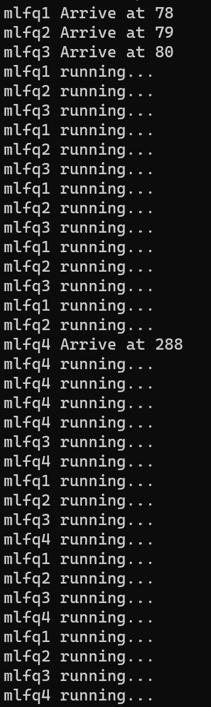
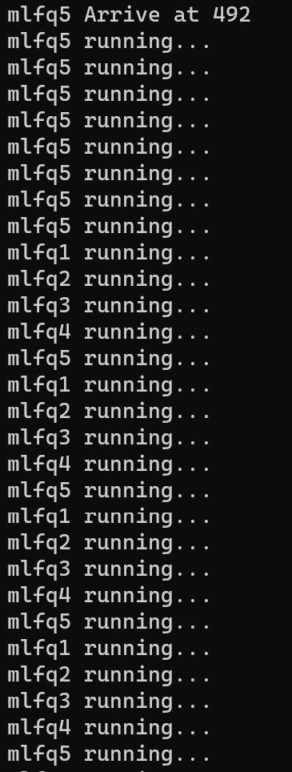
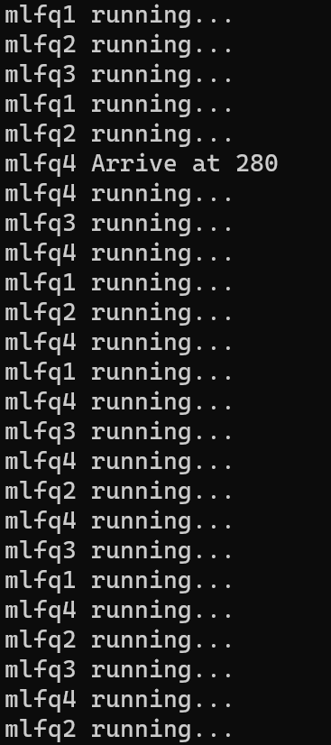
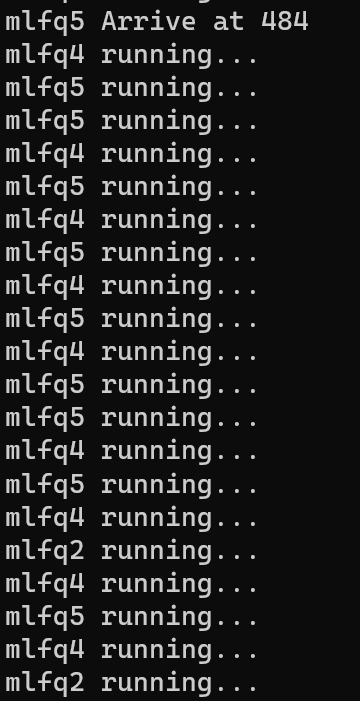
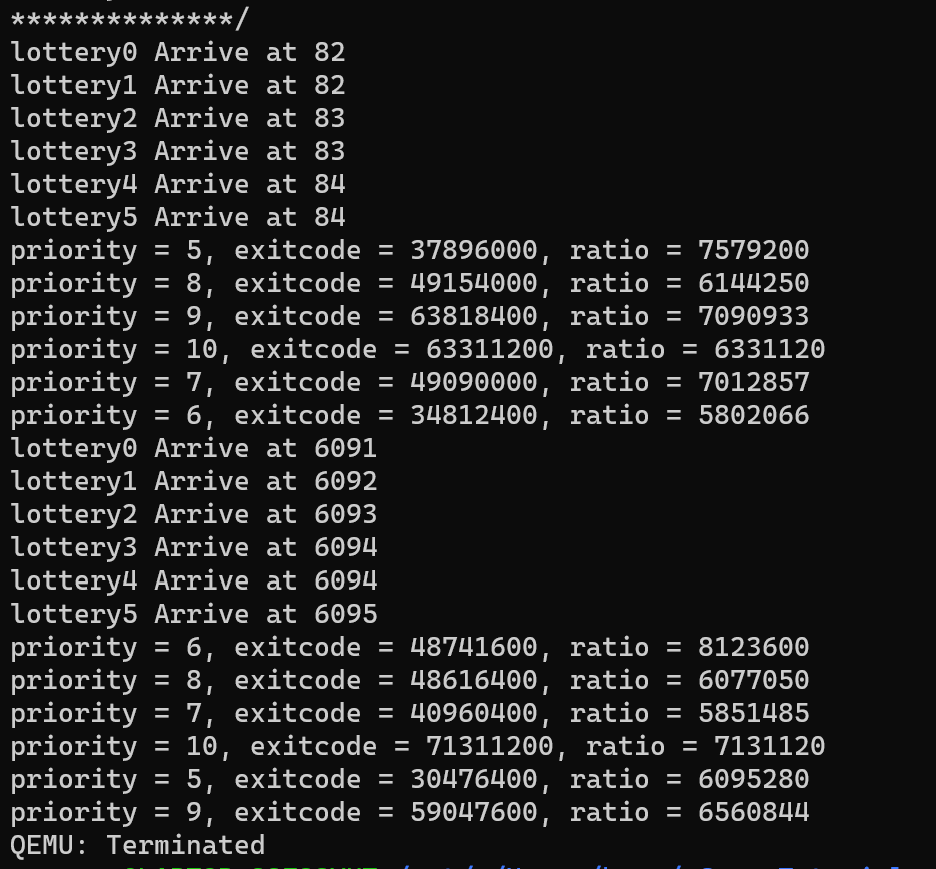
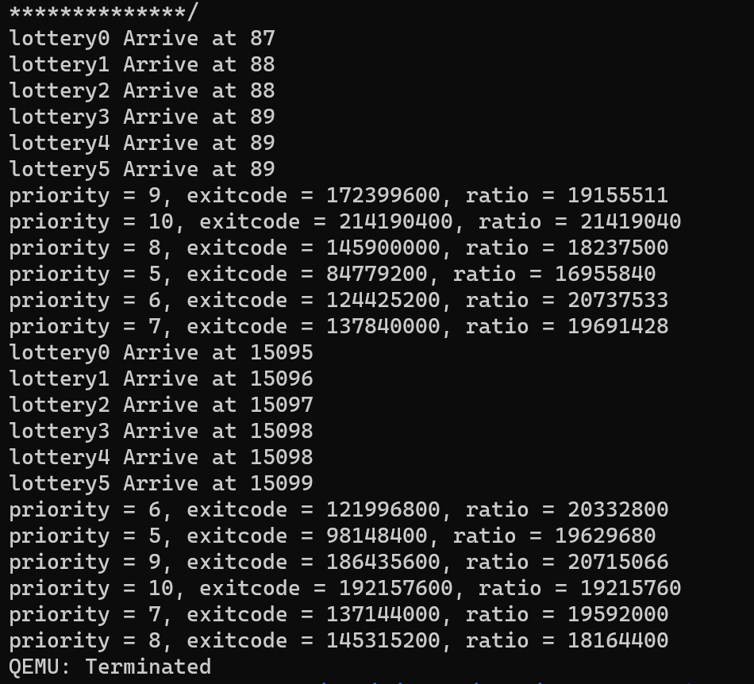
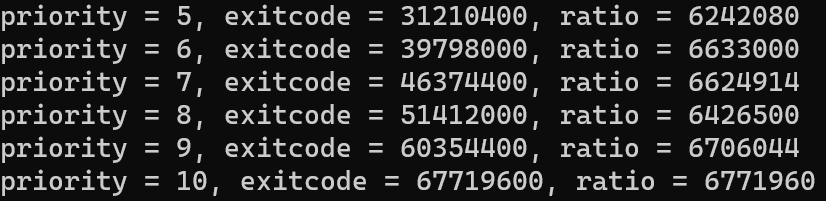

# 通用计算机系统的调度

### 固定优先级的多级队列(MQ)

多级队列调度算法将就绪队列分成多个单独队列。根据进程属性，如内存大小、进程优先级、进程类型等，一个进程永久分到一个队列，每个队列有自己的调度算法，通常在队列中采用RR调度。而队列间则通常采用固定优先级抢占调度，比如为前台队列设置更高的优先级，使前台队列先于后台队列执行。

因此，在实现时，我们将原本的就绪队列一分为多，按照用户给定的优先级将进程置于不同的队列中，按照队列顺序以RR调度为基础执行。

### 多级反馈队列(MLFQ)

通常在使用多级队列调度算法时，进程进入系统时被永久地分配到某个队列。例如，如果前台和后台进程分别具有单独队列，那么进程并不从一个队列移到另一个队列，这是因为进程不会改变前台或后台的性质。这种设置的优点是调度开销低，缺点是不够灵活。

相反，多级反馈队列调度算法允许进程在队列之间迁移。这种想法是，根据不同 CPU 执行的特点来区分进程。如果进程使用过多的 CPU 时间，那么它会被移到更低的优先级队列。这种方案将 I/O 密集型和交互进程放在更高优先级队列上。由此确定的多级反馈队列调度则按照如下条件执行：

1. 创建进程并让进程首次进入就绪队列时，设置进程的优先级为最高优先级。
2. 进程用完其时间配额后，就会降低其优先级。

#### 实现

那么在MQ的基础上，我们记录一个优先级，初始设为最高，将所有的进程初始均放入第一个队列中，每当时间片轮转，当前进程未执行完毕，则降低一个优先级，将其调整到下一队列，而从最高队列重新选择进程执行，直到当前队列为空为止。

#### 测试

```
static TESTS: &[&str] = &[
    "mlfq1\0",
    "mlfq2\0",
    "mlfq3\0",
    "mlfq4\0",
    "mlfq5\0",
];
	if i == 3 || i == 4{
            sleep(200);
        }
```

共5个mlfq测试进程，其中mlfq4和5的到达会依次延迟200.

按照MLFQ，前200内，123将轮番执行，共同降低优先级，那么在4到达时，4将处于最高优先级，于是会连续执行较多时间片，之后再和123共同轮番执行；5到达后，5和1将拥有比之前4和1之间更大的优先级差，因此会连续执行更多时间片，再共同轮转执行。

<center>
<figure>
    
    
</figure>
</center>

现在让mlfq4模拟交互式，让其在时间片内通过sleep主动暂停运行，而在下个时间片被唤醒。



可以看到，4不再是连续占用时间片，但是每次被唤醒时都能得到优先的运行。即使是5到达，拥有最高优先级：



仍然是45交替执行，直到5和123同优先级，4和1235交替执行。

### 公平共享(FSS)

从某种程度上看，MLFQ调度策略总提到的优先级就是对公平性的一种划分方式，有些进程优先级高，会更快地得到处理器执行，所分配到的处理器时间也多一些。但MLFQ并不是把公平性放在第一位。如果把公平性放在首位，我们就可以设计出另外一类调度策略 – 公平份额（Fair Share，又称为 比例份额，Proportional Share）调度。其基本思路是基于每个进程的重要性（即优先级）的比例关系，分配给该进程同比例的处理器执行时间。

### 彩票调度(Lottery)

一种有意思的FSS调度是彩票调度（Lottery Scheduling），它是从经济学的的彩票行为中吸取营养，模拟了购买彩票和中奖的随机性，给每个进程发彩票，进程优先级越高，所得到的彩票就越多；然后每隔一段时间（如，一个时间片），举行一次彩票抽奖，抽出来的号属于哪个进程，哪个进程就能运行。

在每个时间片到时，操作系统就抽取彩票，由于操作系统已知总彩票数，所以操作系统产生一个从0到total的随机数作为获奖彩票号，拥有这个彩票号的进程中奖，并获得下一次处理器执行机会。通过在一段较长的时间内不断地抽彩票，基于统计学，可以保证两个两个进程可以获得与优先级等比例的处理器执行时间。

#### 实现

基本按照原理实现即可，记录进程优先级队列，与就绪队列一一对应，记录总数total为优先级之和乘一个扩大倍数100.每次fetch任务就产生一个total内的随机数，落在哪个范围就将对应的进程取出。需要注意的是由于优先级的初始值一般设为最高，因此要特别设定initproc的优先级为1，使之基本不会得到调度。

#### 测试

```
pub fn count_during(prio: isize) -> isize {
    let start_time = get_time();
    let mut acc = 0;
    set_priority(prio);
    loop {
        spin_delay();
        acc += 1;
        if acc % 400 == 0 {
            let time = get_time() - start_time;
            if time > MAX_TIME {
                return acc;
            }
        }
    }
}
fn spin_delay() {
    let mut j = true;
    for _ in 0..10 {
        j = !j;
    }
}
```

上面是测例Lottery0-5的主体部分，差别在于set_priority(prio)的prio值从5到10变化。因此，可以预测最终得到的acc的值应该随着prio的增大而增大，且基本成比例。但是由于随机数的性质，一般来说会有误差：



设定每次测试的测试时间为4000ms时，虽然从exitcode可以大概看出满足随着prio的增大而增大的关系，但是仍有部分prio增大acc反而减小，而且ratio的浮动也比较大。

延长测试时间到12000ms，终于可以得到一个比较好的结果：



exitcode随prio增大，且ratio基本稳定了。

### 步长调度(Stride)

另一种FSS调度为Stride调度。其基本思路是：每个进程有一个步长（Stride）属性值，这个值与进程优先级成反比，操作系统会定期记录每个进程的总步长，即行程（pass），并选择拥有最小行程值的进程运行。

#### 实现

1. 为每个进程设置一个当前 stride，表示该进程当前已经运行的“长度”。另外设置其对应的 pass 值（只与进程的优先权有关系），表示对应进程在调度后，stride 需要进行的累加值。
2. 每次需要调度时，从当前 runnable 态的进程中选择 stride 最小的进程调度。对于获得调度的进程 P，将对应的 stride 加上其对应的步长 pass。
3. 一个时间片后，回到上一步骤，重新调度当前 stride 最小的进程。

#### 测试

与Lottery的测例一致，但结果更加优美：


