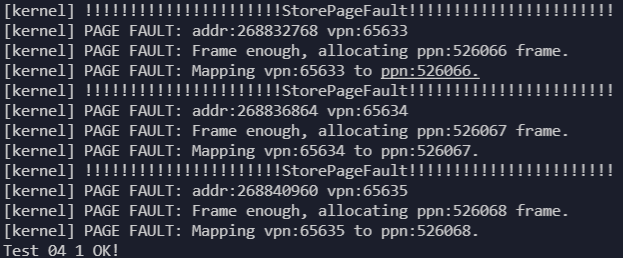
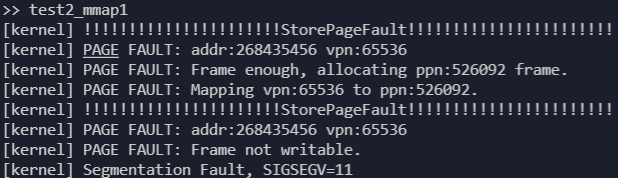
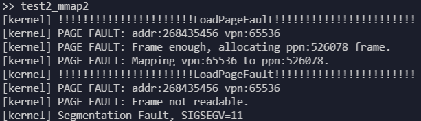
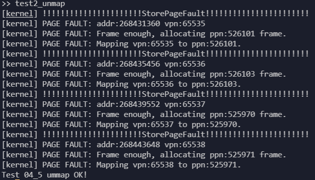

# 用户态程序测试

主要使用`mmap`和`munmap`两个系统调用进行测试。

目前使用`ch4`中的测例进行测试，结果如下：

首先可以看到操作系统启动后可以使用的物理页面数量为454：

<div align=center>


</div>

对于`test2_mmap0`，将其中len设置得较大，使得其分配的内存大于操作系统可以使用得总的物理页面内存，就可以触发物理页面的换入和换出：

```rust
#[no_mangle]
fn main() -> i32 {
    let start: usize = 0x10000000;
    let len: usize = 4096 * 100;
    let prot: usize = 3;
    assert_eq!(0, mmap(start, len, prot));
    for i in start..(start + len) {
        let addr: *mut u8 = i as *mut u8;
        unsafe {
            *addr = i as u8;
        }
    }
    for i in start..(start + len) {
        let addr: *mut u8 = i as *mut u8;
        unsafe {
            assert_eq!(*addr, i as u8);
        }
    }
    println!("Test 04_1 OK!");
    0
}
```

将其设置为`4096 * 100`，即需要100个物理页面，此时操作系统可用的物理页面足够，只触发`StorePageFault`并通过测试：

<div align=center>



</div>

将其设置为`4096 * 800`，即需要800个物理页面，此时操作系统可用的物理页面不足，需要换入和换出物理页面，会触发`StorePageFault`和`LoadPageFault`，并通过测试：

<div align=center>


</div>

对于`test2_mmap1`，程序分配了只读的一个物理页面的内存后，尝试修改内存：

```rust
#[no_mangle]
fn main() -> i32 {
    let start: usize = 0x10000000;
    let len: usize = 4096;
    let prot: usize = 1;
    assert_eq!(0, mmap(start, len, prot));
    let addr: *mut u8 = start as *mut u8;
    unsafe {
        *addr = start as u8;
    }
    println!("Should cause error, Test 04_2 fail!");
    0
}
```

结果如下，先触发缺页异常分配一个物理页面，然后同一条指令再次触发缺页异常，被判断为修改不可写的物理页面结束进程:

<div align=center>



</div>

对于`test2_mmap2`，程序分配了只写的一个物理页面的内存后，尝试访问内存：

```rust
#[no_mangle]
fn main() -> i32 {
    let start: usize = 0x10000000;
    let len: usize = 4096;
    let prot: usize = 2;
    assert_eq!(0, mmap(start, len, prot));
    let addr: *mut u8 = start as *mut u8;
    unsafe {
        // *addr = start as u8; // can't write, R == 0 && W == 1 is illegal in riscv
        assert!(*addr != 0);
    }
    println!("Should cause error, Test 04_2 fail!");
    0
}
```

结果如下，先触发缺页异常分配一个物理页面，然后同一条指令再次触发缺页异常，被判断为读取不可读的物理页面结束进程:

<div align=center>



</div>

对于`test2_unmap`，其用来测试`mmap`和`munmap`的正确性，也可以测试缺页异常处理的正确性：

```rust
#[no_mangle]
fn main() -> i32 {
    let start: usize = 0x10000000;
    let len: usize = 4096;
    let prot: usize = 3;
    assert_eq!(0, mmap(start, len, prot));
    assert_eq!(mmap(start + len, len * 2, prot), 0);
    assert_eq!(munmap(start, len), 0);
    assert_eq!(mmap(start - len, len + 1, prot), 0);
    // println!("~~~~~~");
    for i in (start - len)..(start + len * 3) {
        let addr: *mut u8 = i as *mut u8;
        unsafe {
            *addr = i as u8;
        }
    }
    for i in (start - len)..(start + len * 3) {
        let addr: *mut u8 = i as *mut u8;
        unsafe {
            assert_eq!(*addr, i as u8);
        }
    }
    println!("Test 04_5 ummap OK!");
    0
}
```

结果如下，触发四次缺页异常并分配物理页面通过测试：

<div align=center>



</div>
